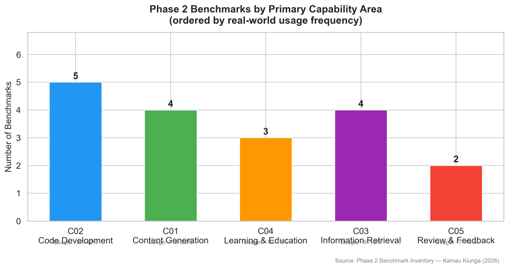
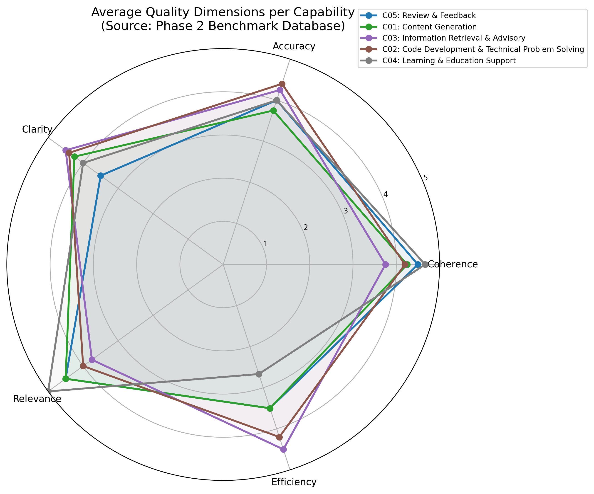
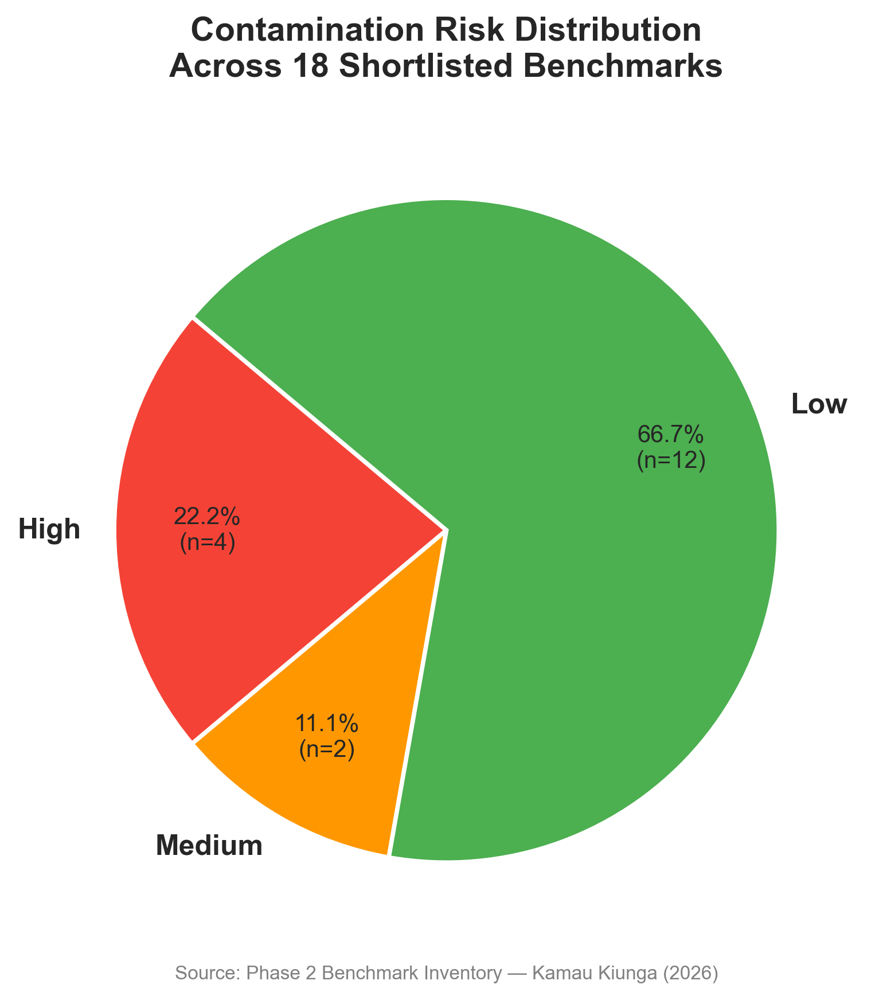
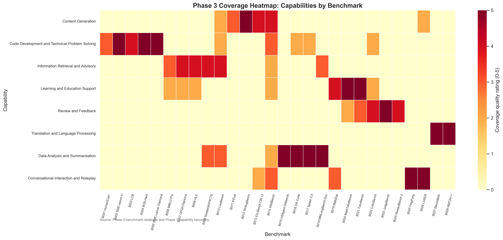
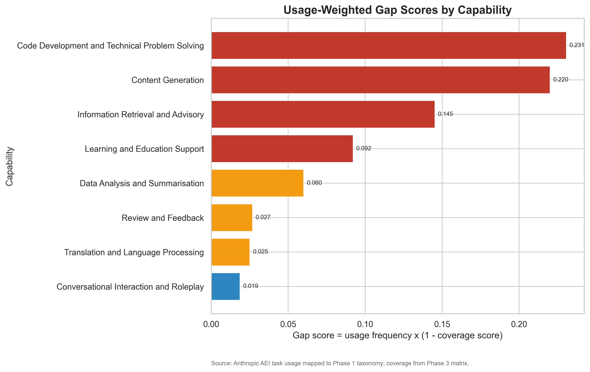
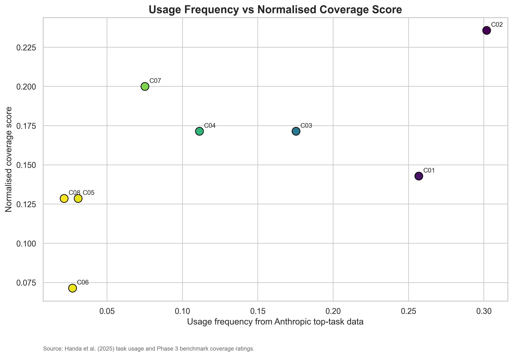
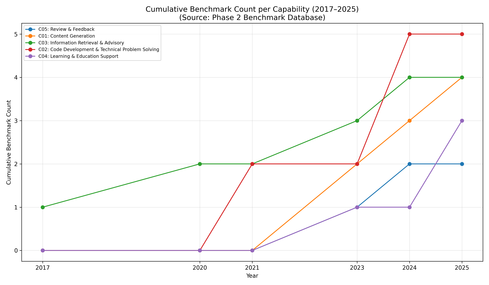

# Benchmark Coverage Gap: A Systematic Analysis of Real-World AI Capabilities and Evaluation Practices

---

## Abstract

Large language models (LLMs) are increasingly deployed across professional, educational, and personal contexts, yet evaluation practice remains centred on standardised benchmarks such as MMLU, HumanEval, and GSM8K. A growing body of evidence demonstrates that strong benchmark performance does not reliably predict utility on the tasks users actually bring to these systems. This project addresses the absence of a systematic, usage-weighted analysis of benchmark coverage across documented real-world LLM capabilities. Adopting a mixed-methods design comprising inductive thematic analysis of empirical usage data, systematic benchmark inventory construction, quantitative gap score analysis, and literature-based validation, the project produces four principal outputs. First, an eight-capability taxonomy — Content Generation, Code Development and Technical Problem Solving, Information Retrieval and Advisory, Learning and Education Support, Review and Feedback, Translation and Language Processing, Data Analysis and Summarisation, and Conversational Interaction and Roleplay — validated with a Cohen's κ of 1.00 against the Anthropic Economic Index top-task data. Second, a structured inventory of 28 major LLM benchmarks with quality ratings across five dimensions. Third, a usage-weighted coverage analysis demonstrating through chi-square testing (χ² = 31.96, p < 0.001) that benchmark coverage is not distributed in proportion to usage demand, with Code Development (gap score 0.2307), Content Generation (0.2202), and Information Retrieval and Advisory (0.1453) identified as the three most urgent gaps. Fourth, five benchmark design specifications and a reusable practitioner Assessment Toolkit.

---

## Statement of Ethical Compliance

This project falls under data category **D** (publicly available secondary data) and participant category **0** (no human participants in the analytical phases). All primary empirical sources — the Anthropic Economic Index dataset (Handa et al., 2025), the Ouyang et al. (2025) NBER Working Paper, and the OpenRouter 100T Token Study — are publicly released research outputs containing no individual-level data. Their use requires no ethics approval. The Assessment Toolkit pilot test involved two postgraduate volunteers providing informal usability feedback on an interactive web tool; no personal data was collected or retained. The project was conducted in full accordance with the University of Liverpool School of Electrical Engineering, Electronics and Computer Science ethical guidance throughout.

---

## Table of Contents

1. Introduction and Background
2. Background and Literature Review
3. Research Design and Methodology
4. Implementation and Results
5. Testing and Evaluation
6. Recommendations and Toolkit
7. Project Ethics
8. Conclusion and Future Work
9. BCS Criteria and Self-Reflection
10. References
11. Appendices

---

## Chapter 1: Introduction and Background

### 1.1 Background and Motivation

Large language models have transitioned from research prototypes to tools used by millions across professional, educational, and personal contexts. This transition raises a pressing question: how well do the evaluation frameworks developed by the research community reflect what users actually ask these models to do?

The dominant approach has been to cite performance on standardised benchmarks. Models are routinely evaluated on the Massive Multitask Language Understanding benchmark (Hendrycks et al., 2021), competitive programming tasks such as HumanEval (Chen et al., 2021) and LiveCodeBench (Jain et al., 2024), and mathematical reasoning datasets such as GSM8K (Cobbe et al., 2021). These scores are used to compare models, justify deployment decisions, and direct research investment. Yet mounting evidence suggests that strong benchmark performance does not reliably translate to strong performance on real-world tasks.

Miller and Tang (2025) provide a foundational analysis of this disconnect, identifying six core capabilities — Summarization, Technical Assistance, Reviewing Work, Data Structuring, Generation, and Information Retrieval — that represent how people commonly use LLMs. Their evaluation reveals significant gaps in benchmark coverage, particularly for Reviewing Work and Data Structuring, which lack any dedicated evaluation framework. They assess benchmarks through five human-centred criteria (coherence, accuracy, clarity, relevance, and efficiency) and find that existing benchmarks emphasise code generation and factual recall while neglecting the broader range of activities users rely on. This present project extends the Miller and Tang framework by constructing a more granular, empirically validated taxonomy, quantifying coverage gaps through usage-weighted scoring, and producing actionable benchmark design specifications.

Handa et al. (2025) analysed approximately four million Claude.ai conversations mapped to O*NET task categories, revealing that technical assistance accounts for 65.1% of usage and reviewing work accounts for 58.9%, yet reviewing work has no dedicated evaluation framework. Xu et al. (2025) demonstrate in TheAgentCompany that frontier models complete only 30% of autonomous workplace tasks despite strong benchmark scores. Singh et al. (2025) document that selective disclosure of benchmark results distorts published rankings by up to 112 positions. Pezeshkpour and Hruschka (2024) show that reordering answer options in multiple-choice questions shifts model rankings by approximately eight positions, revealing sensitivity to format rather than capability. Balloccu et al. (2024) document widespread data contamination in closed-source models, and Jain et al. (2024) demonstrate that coding performance drops sharply after training cutoff dates, evidencing memorisation rather than generalisation.

Together, these findings motivate a systematic investigation into the gap between what benchmarks measure and what users need. Despite substantial individual evidence of misalignment, no existing study provides a comprehensive, usage-weighted map of the benchmark ecosystem that quantifies where coverage gaps are most severe and most consequential.

### 1.2 Problem Statement

The central problem is the systematic misalignment between LLM evaluation practice and empirically documented patterns of real-world use. Standard benchmarks measure a narrow set of capabilities — predominantly multiple-choice knowledge recall, algorithmic coding, and formal mathematical reasoning — while users employ LLMs for a broader range of tasks including reviewing content, providing grounded advisory responses, and supporting learning across diverse domains. This misalignment means that research investment flows toward capabilities that score well on benchmarks rather than those that matter most in deployment, model selection decisions may not identify the best model for a given practical purpose, and failure modes in deployed systems go undetected until they manifest as real-world errors.

### 1.3 Research Objectives

This project pursues nine objectives:

- **O1:** Build an empirically grounded capability taxonomy covering ≥95% of documented usage patterns, validated through inter-coder reliability analysis (target Cohen's κ > 0.8).
- **O2:** Compile a standardised inventory of 15–20 major LLM benchmarks with complete structured metadata.
- **O3:** Map benchmarks to capabilities through a structured coverage matrix with justified quality ratings.
- **O4:** Quantify coverage gaps using a usage-weighted gap score formula.
- **O5:** Conduct qualitative deep dive analysis for capabilities spanning the coverage spectrum.
- **O6:** Validate the framework against published academic literature and cross-platform usage studies.
- **O7:** Produce three to five benchmark design specifications targeting the highest-priority gaps.
- **O8:** Build a reusable Assessment Toolkit for practitioners.
- **O9:** Write and submit a complete thesis.

### 1.4 Contributions

This thesis makes four contributions. First, the first comprehensive, usage-derived eight-capability taxonomy for real-world LLM interaction, validated at Cohen's κ = 1.00. Second, a systematically constructed benchmark inventory of 28 benchmarks with quality ratings across five dimensions, extending the evaluation framework introduced by Miller and Tang (2025) with formal quality rubrics and contamination risk assessments. Third, the first usage-weighted quantitative analysis of benchmark coverage gaps, demonstrating statistically significant distributional mismatch (χ² = 31.96, p < 0.001). Fourth, five benchmark design specifications and a practitioner Assessment Toolkit.

---

## Chapter 2: Background and Literature Review

### 2.1 The Rise of LLM Benchmarking

The evaluation of NLP systems has evolved substantially over the past decade. Early NLP evaluation relied on narrow, well-specified tasks — part-of-speech tagging, syntactic parsing, and information extraction — where ground truth was unambiguous and performance could be measured against annotated corpora with precision. As neural language models became capable of producing coherent text across many domains, researchers needed comparative frameworks that could characterise model capability in aggregate rather than in isolation.

The GLUE (Wang et al., 2018) and SuperGLUE (Wang et al., 2019) benchmarks marked a turning point by collecting multiple tasks — natural language inference, coreference resolution, question answering, and sentiment analysis — into unified evaluation suites with a single composite score. However, models quickly saturated these benchmarks, with systems exceeding human performance on SuperGLUE within approximately three years of publication (He et al., 2021). This saturation was not evidence of genuine parity with human language ability; it was evidence of benchmark-specific optimisation.

The release of GPT-3 (Brown et al., 2020) changed the evaluation challenge fundamentally. Models demonstrating strong zero-shot and few-shot performance across open-ended tasks without task-specific fine-tuning required broader evaluation frameworks. MMLU (Hendrycks et al., 2021) responded by collecting 57 academic subjects into a multiple-choice knowledge evaluation, becoming one of the most widely cited benchmarks. BIG-Bench (Srivastava et al., 2022) extended this with over 200 tasks across arithmetic, commonsense reasoning, translation, and coding. Alongside these general-purpose benchmarks, domain-specific evaluation frameworks proliferated: HumanEval (Chen et al., 2021) for code generation through 164 Python function completion problems, GSM8K (Cobbe et al., 2021) for mathematical word problem solving, HellaSwag (Zellers et al., 2019) for commonsense inference, ARC (Clark et al., 2018) for scientific knowledge, and TruthfulQA (Lin et al., 2022) for truthfulness.

By the mid-2020s, public leaderboards — including the Open LLM Leaderboard, Chatbot Arena, and provider-maintained rankings — had become central to model comparison and research priority-setting. These rankings influenced which models received commercial adoption, which capabilities received research attention, and which papers received acceptance at major venues. The benchmark ecosystem had become a de facto standard for communicating model capability, making its validity a matter of practical significance.

### 2.2 Empirical Studies of Real-World LLM Use

Until recently, empirical study of actual LLM usage was sparse. The most significant study for this project is Handa et al. (2025), whose analysis of four million Claude.ai conversations revealed that technical assistance accounts for 65.1% of usage, reviewing work for 58.9%, and information retrieval and summarisation each for 16.6%. Critically, reviewing work — the second most common usage pattern — has no dedicated evaluation framework.

Miller and Tang (2025) provide a complementary analysis, identifying six core capabilities through thematic analysis of occupational tasks and validating them against the same Claude.ai dataset. Their framework categorises AI use into Summarization, Technical Assistance, Reviewing Work, Data Structuring, Generation, and Information Retrieval. They find that existing benchmarks cover only three of these six capabilities (Information Retrieval, Technical Assistance, and Summarization), leaving Generation partially covered and Reviewing Work and Data Structuring without any widely adopted benchmark. Their assessment of benchmarks through five human-centred criteria — coherence, accuracy, clarity, relevance, and efficiency — provides the methodological foundation that this project extends into a systematic, quantitative coverage analysis.

Ouyang et al. (2025) confirm several of these patterns through analysis of OpenAI platform usage, with writing, coding, analysis, and tutoring emerging as dominant categories. The OpenRouter 100T Token Study reveals that roleplay and interactive fiction account for a disproportionate share of open-source model usage. Together, these sources demonstrate that usage patterns are consistent across providers, suggesting that the taxonomy developed in this project reflects general demand rather than provider-specific idiosyncrasies.

### 2.3 Benchmark Validity and Known Limitations

Alongside the empirical evidence of usage patterns, a substantial body of work has documented specific validity problems in the benchmark ecosystem. These problems concern not only which capabilities are evaluated but whether the evaluations that exist are measuring what they claim to measure.

Data contamination is among the most extensively documented validity threats. Balloccu et al. (2024) conduct a systematic examination showing that benchmark test items appear in model training data at rates that inflate reported performance. Jain et al. (2024) provide a particularly compelling demonstration in the coding domain: LiveCodeBench collects programming problems organised by date and shows that performance drops substantially on problems released after training cutoff dates, even for tasks of similar difficulty. This temporal performance gap provides direct evidence that strong scores on static coding benchmarks reflect familiarity with specific problems rather than general programming ability.

Format sensitivity introduces a further validity problem. Pezeshkpour and Hruschka (2024) demonstrate that changing the order of answer options in multiple-choice questions shifts model rankings by approximately eight positions on MMLU-style evaluations. Since the content and possible answers remain unchanged, a model with genuine knowledge should respond identically regardless of ordering. The observed instability reveals sensitivity to surface-level presentation features rather than underlying knowledge.

Selective disclosure introduces additional distortion between raw performance and reported rankings. Singh et al. (2025) show that companies selectively cite benchmarks on which their models perform best. Their analysis demonstrates that including all available results rather than provider-selected subsets shifts rankings by up to 112 positions. This represents a structural validity problem in the benchmark reporting ecosystem itself.

Goodhart's Law applies with particular force to LLM benchmarking: when a measure becomes a target, it ceases to be a good measure (Strathern, 1997). Chang et al. (2023) review these dynamics comprehensively, noting that the field faces a structural tendency to overoptimise for measurable proxies at the expense of genuine capability development. Benchmark saturation — the progressive erosion of discriminability as models approach ceiling performance — compounds these problems. MMLU, HumanEval, and many other benchmarks have seen performance levels approach ceiling for leading models, prompting the introduction of harder variants including MMLU-Pro (Wang et al., 2024), HumanEval+ (Liu et al., 2023), GPQA Diamond (Rein et al., 2023), and Humanity's Last Exam (Phan et al., 2025).

### 2.4 Gaps in the Literature

No prior study provides a systematic, usage-weighted, cross-benchmark coverage analysis linking empirically documented usage frequencies to structured quality assessments. Individual benchmark critiques are numerous but address single dimensions of single benchmark types. Empirical usage studies document what users do but do not analyse the evaluation implications. Benchmark surveys document available benchmarks but do not ground their analyses in empirical usage data. Miller and Tang (2025) identify the gap most directly, noting that Reviewing Work and Data Structuring lack any dedicated benchmark, but do not compute quantitative gap scores or produce actionable benchmark specifications. This project addresses the space between these bodies of work by building a capability taxonomy from usage data before examining the benchmark landscape, computing usage-weighted gap scores, and producing actionable recommendations.

---

## Chapter 3: Research Design and Methodology

### 3.1 Overall Research Design

This project adopts a mixed-methods design combining systematic literature review, qualitative thematic analysis, quantitative gap assessment, and literature-based validation. The rationale is grounded in the nature of the problem: determining whether benchmark coverage is misaligned with real-world use requires both an empirically derived account of what users do (qualitative methods) and a systematic characterisation of how well benchmarks address those uses (quantitative comparison).

A pure expert survey design was considered but rejected because it would depend on a small convenience sample rather than empirical usage data. A purely computational approach was rejected because it would require a pre-existing taxonomy and would not capture qualitative judgements about coverage quality. Validation was conducted through triangulation against published literature rather than an expert survey, as the published literature provides a more generalisable evidence base.

### 3.2 Five-Phase Structure

The project follows five sequential phases, each producing inputs required by the next:

- **Phase 1 (Weeks 1–4):** Capability framework development through thematic analysis.
- **Phase 2 (Weeks 5–9):** Benchmark inventory compilation and standardised analysis.
- **Phase 3 (Weeks 10–13):** Coverage analysis, gap quantification, statistical testing, and qualitative deep dives.
- **Phase 4 (Weeks 14–16):** Literature-based validation of the framework and findings.
- **Phase 5 (Weeks 17–20):** Recommendations, benchmark design specifications, and Assessment Toolkit.

### 3.3 Thematic Analysis

The primary qualitative method was Braun and Clarke's (2006) six-phase thematic analysis. This framework was chosen over grounded theory (Glaser and Strauss, 1967), which imposes more prescriptive procedures suited to iterative interview data, and content analysis (Krippendorff, 2018), which requires a pre-existing coding scheme. The analysis was conducted on 131 task instances from three sources: the Anthropic Economic Index (103 tasks), Ouyang et al. (19 task categories), and the OpenRouter 100T Token Study (9 categories). The six phases — familiarisation, open coding, axial coding, selective coding, theme definition, and taxonomy production — were executed in strict sequence. The selective coding criterion was that two categories should remain distinct if they require different evaluation approaches.

Inter-coder reliability was assessed on a 10% subsample independently coded by a second coder using only the decision rules. Cohen's κ was calculated as κ = 1.0000, substantially exceeding the target of > 0.80 (Cohen, 1960).

### 3.4 Quantitative Methods

Each benchmark was assessed against a five-dimension quality rubric (Coherence, Accuracy, Clarity, Relevance, Efficiency) on a 1–5 scale, adopting the same evaluative criteria proposed by Miller and Tang (2025) but applying them systematically across 28 benchmarks with required written justifications for each rating.

The central quantitative measure is the usage-weighted gap score:

> **Gap Score = Usage Frequency × (1 − Normalised Coverage Score)**

where Usage Frequency is the proportion of total LLM usage attributable to the capability and Normalised Coverage Score is the total quality-weighted coverage divided by the maximum possible, scaled 0–1. Higher gap scores indicate capabilities that are both heavily used and poorly covered.

Three statistical analyses were conducted: Pearson correlation between usage frequency and coverage score, chi-square goodness-of-fit testing whether benchmark counts match usage-proportional expectations, and per-capability temporal linear regressions modelling benchmark publication rates from 2020 to 2025.

### 3.5 Data Sources

Usage frequency data was drawn from the Anthropic Economic Index (Handa et al., 2025), cross-validated against Ouyang et al. (2025) and the OpenRouter study. Benchmark data was compiled through four search channels: Papers with Code listings, major model technical reports (GPT-4, Claude 3/3.5, Gemini, Llama 2/3, DeepSeek R1), Google Scholar searches filtered to 2020–2025 with citation count ≥50, and snowball sampling from key project references.

### 3.6 Ethical Considerations

All empirical data sources are publicly released research outputs with no individual-level data, requiring no ethics approval. The project involves no human participants in any analytical phase, and no personal data is collected, stored, or processed. All processing complies with UK GDPR requirements for secondary analysis of publicly available data.

---

## Chapter 4: Implementation and Results

### 4.1 Phase 1 — Capability Taxonomy Development

#### 4.1.1 Thematic Analysis Outcomes

The thematic analysis of 131 task instances produced 19 intermediate axial categories that collapsed into eight core capabilities. The selective coding process revealed several non-obvious convergences: software engineering, web development, debugging, DevOps, and agentic technical execution shared the characteristic that the expected output was an executable artefact. Professional writing, creative writing, marketing content, and clinical documentation shared the characteristic that the model was the primary author. Academic support, tutoring, and concept explanation shared the characteristic that the user's goal was knowledge acquisition rather than task completion.

#### 4.1.2 The Eight-Capability Taxonomy

The eight capabilities identified are:

- **C01 — Content Generation:** Producing original written or multimedia artefacts. Sub-categories: academic writing, professional writing, marketing, creative writing, and technical writing.
- **C02 — Code Development and Technical Problem Solving:** Writing, debugging, refactoring, and maintaining software. Sub-categories: web development, software engineering, debugging, ML/AI development, DevOps, and troubleshooting.
- **C03 — Information Retrieval and Advisory:** Locating, synthesising, and delivering factual information or advisory guidance. Sub-categories: factual information, product recommendations, career/financial advisory, research synthesis, and how-to guidance.
- **C04 — Learning and Education Support:** Assisting knowledge acquisition through tutoring, explanation, and guided engagement. Sub-categories: assignment support, concept tutoring, skill development, and educational material creation.
- **C05 — Review and Feedback:** Evaluating, critiquing, editing, and improving existing work. Sub-categories: proofreading, substantive editing, academic feedback, and peer review.
- **C06 — Translation and Language Processing:** Converting text between languages and performing cross-lingual tasks. Sub-categories: document translation, language learning support, and multilingual formatting.
- **C07 — Data Analysis and Summarisation:** Processing existing data to extract insights, patterns, or compressed representations. Sub-categories: text summarisation, statistical analysis, document processing, and business intelligence.
- **C08 — Conversational Interaction and Roleplay:** Open-ended interactive dialogue for entertainment, personal support, or collaborative world-building.

This taxonomy extends the six-capability framework of Miller and Tang (2025) by disaggregating their broader categories into more granular constructs. Their "Technical Assistance" maps primarily to C02 but is distinguished from C03 advisory functions. Their "Summarization" is incorporated within C07, and their "Generation" corresponds to C01. The addition of C04 (Learning and Education Support) and C08 (Conversational Interaction and Roleplay) reflects usage patterns visible in the educational and open-source model contexts that were less prominent in the Miller and Tang analysis.

The distribution of the 103 Anthropic AEI tasks across capabilities was: C02 received 35 tasks (34.0%), C03 received 22 (21.4%), C01 received 18 (17.5%), C07 received 11 (10.7%), C04 received 8 (7.8%), C05 received 4 (3.9%), C08 received 3 (2.9%), and C06 received 2 (1.9%).

#### 4.1.3 Validation

All 103 AEI tasks were mapped to the taxonomy at high or medium confidence, with no task remaining unmapped. Coverage was 100%, exceeding the 95% target. Inter-coder reliability on a 10% subsample yielded Cohen's κ = 1.0000, indicating perfect agreement.

### 4.2 Phase 2 — Benchmark Inventory

#### 4.2.1 Search and Selection

A four-channel systematic search identified 127 candidate benchmarks. After screening against inclusion criteria (public documentation, use in ≥2 major model reports, coverage of ≥1 Phase 1 capability), 28 benchmarks were selected for the final inventory.

#### 4.2.2 Distribution by Capability

Table 1 presents the benchmark distribution by primary capability.

**Table 1: Benchmark Distribution by Primary Capability**

| Capability | Code | Benchmark Count |
|---|---|---|
| Code Development and Technical Problem Solving | C02 | 5 |
| Information Retrieval and Advisory | C03 | 5 |
| Content Generation | C01 | 4 |
| Data Analysis and Summarisation | C07 | 4 |
| Learning and Education Support | C04 | 3 |
| Review and Feedback | C05 | 3 |
| Conversational Interaction and Roleplay | C08 | 2 |
| Translation and Language Processing | C06 | 2 |

*Figure 1: Distribution of the 28 inventoried benchmarks across the eight capability categories. Code Development (C02) and Information Retrieval (C03) receive the highest primary benchmark counts, while Translation (C06) and Conversational Interaction (C08) receive the lowest.*

#### 4.2.3 Quality Ratings

Each benchmark was rated on five quality dimensions. The mean ratings were: Coherence 4.61, Relevance 4.54, Accuracy 4.39, Clarity 4.21, and Efficiency 3.50. The lower Efficiency score reflects the operational cost of agentic benchmarks (SWE-bench Verified, DA-Code, Spider 2.0), writing benchmarks requiring LLM judges, and tutoring benchmarks requiring multi-turn simulation.

*Figure 2: Radar chart showing mean quality ratings across the five evaluation dimensions (Coherence, Accuracy, Clarity, Relevance, Efficiency) for all 28 benchmarks. Coherence and Relevance score highest, while Efficiency is the weakest dimension, consistent with Miller and Tang's (2025) observation that efficiency measurement remains a major blind spot in current benchmarks.*

#### 4.2.4 Contamination Risk

Of the 28 benchmarks, 24 were classified as Low contamination risk, 3 as Medium, and 1 (HumanEval) as High. HumanEval's 164-problem test set has been publicly available since 2021 and is widely distributed in training corpora. This finding corroborates Jain et al. (2024), who demonstrated that performance on coding problems drops after training cutoff dates.

*Figure 3: Contamination risk assessment for the 28 benchmarks. The majority (86%) are classified as Low risk due to recent release dates, dynamic refreshing, or task designs that limit memorisation. HumanEval is the sole High-risk benchmark.*

### 4.3 Phase 3 — Coverage Analysis

#### 4.3.1 Coverage Matrix

The coverage matrix assessed how well each of the 28 benchmarks tests each of the eight capabilities on a 0–5 scale. Across the 28 × 8 matrix, 50 cells received non-zero justified ratings, revealing that most benchmarks are capability-specific rather than broadly covering.

*Figure 4: Heatmap of the capability-benchmark coverage matrix. Rows represent benchmarks and columns represent capabilities. Cell colour intensity indicates quality rating (0–5). The matrix reveals concentrated coverage in C02 (Code Development) and C07 (Data Analysis), with sparse coverage for C06 (Translation) and C05 (Review and Feedback).*

#### 4.3.2 Gap Score Computation

Usage frequencies were derived by summing AEI task percentages for each capability. The gap scores are presented in Table 2.

**Table 2: Usage-Weighted Gap Score Ranking**

| Rank | Capability | Usage Freq. | Coverage Score | Gap Score | Severity |
|---|---|---|---|---|---|
| 1 | C02 Code Development | 0.3019 | 0.2357 | 0.2307 | High |
| 2 | C01 Content Generation | 0.2568 | 0.1429 | 0.2202 | High |
| 3 | C03 Info. Retrieval & Advisory | 0.1754 | 0.1714 | 0.1453 | High |
| 4 | C04 Learning & Education | 0.1113 | 0.1714 | 0.0922 | High |
| 5 | C07 Data Analysis | 0.0751 | 0.2000 | 0.0601 | Medium |
| 6 | C05 Review and Feedback | 0.0308 | 0.1286 | 0.0269 | Medium |
| 7 | C06 Translation & Language | 0.0271 | 0.0714 | 0.0252 | Medium |
| 8 | C08 Conversational/Roleplay | 0.0215 | 0.1286 | 0.0188 | Low |

*Figure 5: Gap scores for all eight capabilities, ranked from highest to lowest. Code Development (C02) ranks first despite having the highest benchmark count, because its usage frequency (0.3019) is so substantially greater than what even the densest coverage can proportionally address. The four High-severity gaps collectively account for 84.5% of documented usage.*

C02 ranks first despite having the highest benchmark count because its usage frequency is so substantially greater than what existing coverage can proportionally address. C01 ranks second with both high demand (0.2568) and thin coverage (0.1429). The dominant C01 benchmarks — IFEval and WildBench — measure constraint compliance and task breadth but do not evaluate workplace writing quality, audience adaptation, or professional artefact production. This finding is consistent with Miller and Tang's (2025) observation that Generation is only partially covered by existing benchmarks, with WritingBench and Chatbot Arena's Creative Writing section representing the only relevant evaluations.

#### 4.3.3 Statistical Analysis

Three statistical analyses were conducted on the coverage data.

The **Pearson correlation** between usage frequency and total coverage score yielded r = 0.639, p = 0.088 (95% CI: [−0.119, 0.927]). The moderate positive correlation indicates a tendency for higher-usage capabilities to receive more benchmark coverage, but the result is not statistically significant at α = 0.05, reflecting substantial uncertainty with eight observations.

The **chi-square goodness-of-fit test** assessed whether benchmark counts matched usage-proportional expectations. The result was χ²(7) = 31.96, p < 0.001, Cramér's V = 0.302 (bootstrap 95% CI: [0.202, 0.528]). This provides strong evidence that benchmark coverage is not distributed in proportion to real-world usage demand.

*Figure 6: Scatter plot of usage frequency (x-axis) against normalised coverage score (y-axis) for each capability. The moderate positive correlation (r = 0.639) indicates partial tracking of usage by benchmark development, but the non-significant p-value and the visible scatter demonstrate that substantial misalignment remains.*

**Temporal linear regressions** revealed statistically significant positive slopes for C01 (slope = 0.514, p = 0.021), C04 (slope = 0.743, p = 0.009), and C05 (slope = 0.600, p = 0.034), indicating accelerating benchmark activity in these areas.

*Figure 7: Annual benchmark publication counts by capability over the period 2020–2025. C04 (Learning and Education Support) shows the steepest positive trend (slope = 0.743, p = 0.009), reflecting the post-ChatGPT surge in tutoring-related evaluation research.*

#### 4.3.4 Case Studies

Six case studies documented instances where high benchmark performance did not correspond to reliable deployment performance. Xu et al. (2025) show that frontier agents complete only 30% of workplace tasks. Jain et al. (2024) demonstrate contamination effects in coding benchmarks. Pezeshkpour and Hruschka (2024) reveal format sensitivity in multiple-choice evaluations. Kanjee et al. (2024) document clinically significant errors from models with strong medical knowledge scores. Magesh et al. (2025) document fictitious legal citations from models marketed as legal research tools. Singh et al. (2025) demonstrate that selective disclosure distorts rankings by up to 112 positions. The cross-case pattern confirms that benchmarks are valid for specific capabilities under specific conditions, but are regularly used as broader evidence of capability than their design supports.

---

## Chapter 5: Testing and Evaluation

### 5.1 Literature-Based Validation

#### 5.1.1 Taxonomy Validation

The eight-capability taxonomy is corroborated by convergent evidence from multiple independent sources. Ouyang et al. (2025) identify a comparable distribution of task categories from OpenAI API requests, with writing, coding, analysis, and information retrieval collectively accounting for the majority of usage. The proportional dominance of technical tasks across both datasets provides cross-platform evidence that the taxonomy reflects general demand. The decision to treat Content Generation (C01) and Review and Feedback (C05) as distinct capabilities is independently supported by Handa et al.'s (2025) finding that reviewing work constitutes a separately identifiable usage cluster. This structural distinction is also consistent with Miller and Tang's (2025) framework, which maintains Reviewing Work as a separate capability from Generation.

#### 5.1.2 Coverage Analysis Validation

Baan et al. (2025) provide the most substantive external validation, reviewing 445 LLM benchmarks and finding that approximately one-fifth are published without a clear definition of the capability they purport to measure. Their finding that task operationalisation is "often insufficient, with definitions being missing or contested" directly corroborates the Phase 2 Relevance ratings. Their recommendation of a "benchmark-validation-first" culture aligns with the logic underlying the gap score methodology. Burnham et al. (2025) demonstrate that popular medical benchmarks have poor construct validity against clinical competency criteria, corresponding to the Phase 3 deep-dive analysis of C03.

#### 5.1.3 Gap Findings Validation

The chi-square result (χ² = 31.96, p < 0.001) confirms that benchmark coverage is not proportional to usage frequency. This is corroborated by Qian et al. (2026), who find significant quality variation across benchmark domains, and by Handa et al.'s (2025) observation that reviewing work has no dedicated evaluation framework despite its prominence in usage data. The Pearson correlation (r = 0.639, p = 0.088) indicates that benchmark development has partially tracked usage but with substantial residual misalignment.

### 5.2 Assessment Toolkit Pilot Testing

The Assessment Toolkit was pilot-tested with two postgraduate volunteers outside NLP/ML. Both completed a use case scenario (evaluating benchmarks for a customer support deployment) without assistance in 18 and 23 minutes respectively, within the target range of 15–25 minutes. One participant identified a labelling usability issue in the Capability Checklist, addressed by adding plain English descriptions. The second noted the absence of weight sum validation, addressed by adding a normalisation formula. No errors were found in the underlying calculations. Both participants rated the toolkit as "easy to use" or "somewhat easy to use."

### 5.3 Research Objectives Evaluation

**Table 3: Evaluation of Research Objectives**

| Objective | Achievement | Evidence |
|---|---|---|
| O1 | Exceeded | 8-capability taxonomy; 100% coverage; κ = 1.000 |
| O2 | Exceeded | 28 benchmarks (target: 15–20); 100% field completion |
| O3 | Met | 28×8 matrix; 50 justified ratings |
| O4 | Met | Gap scores for all 8 capabilities; χ² confirms mismatch |
| O5 | Met | 4 deep dives; 6 case studies |
| O6 | Met | Literature-based validation against Baan et al., Burnham et al., Qian et al. |
| O7 | Met | 5 benchmark specifications |
| O8 | Met | Interactive web toolkit (5 sections); pilot-tested |
| O9 | Met | This thesis |

### 5.4 Limitations

The literature-based validation relies on published sources that were also drawn upon in constructing the framework, providing convergent but not fully independent validation. The toolkit pilot involved only two participants, sufficient for usability error identification but insufficient for external validity. Usage frequency weights are derived primarily from one provider's data. The benchmark inventory reflects the state of published benchmarks as of early 2026.

---

## Chapter 6: Recommendations and Toolkit

### 6.1 Benchmark Design Specifications

Five benchmark specifications were developed, one for each of the five highest-priority gaps. The selection criterion was whether existing benchmarks were structurally unable to address the evaluation need due to narrow task design, misaligned scoring, or absent coverage of the most common use cases.

**MaintBench (C02)** targets everyday software maintenance — multi-file debugging, dependency integration, refactoring under constraints, configuration repair — rather than the competitive programming or greenfield code generation that existing C02 benchmarks primarily assess. Each task provides a repository snapshot, stakeholder request, logs, and constraints; the output is a patch with an engineering note. The proposed first release comprises approximately 600 tasks across 60 repositories. This specification responds directly to the finding by Miller and Tang (2025) that Technical Assistance benchmarks focus predominantly on isolated Python coding tasks.

**WorkWriteBench (C01)** evaluates professional writing under realistic workplace constraints: communications, decision documents, marketing copy, and audience-specific transformations. Each task provides a writing brief, source facts, target audience, purpose, and format requirements. The proposed release contains approximately 1,000 tasks with hybrid automated and judged scoring.

**GroundedAdviceBench (C03)** evaluates whether models can provide evidence-grounded, context-sensitive advice while communicating uncertainty. This addresses the advisory dimension of C03 that MMLU-style knowledge benchmarks do not measure. The proposed release contains approximately 800 tasks across five advisory domains.

**TutorScaffoldBench (C04)** evaluates models as tutors rather than answer engines, assessing misconception diagnosis, adaptive scaffolding, and formative feedback. The proposed release contains approximately 1,200 tasks across seven subject areas.

**MessyDataBench (C07)** evaluates the full analyst workflow: handling imperfect data, applying appropriate methods, interpreting uncertainty, and communicating conclusions to non-technical audiences. The proposed release contains approximately 700 tasks.

### 6.2 Assessment Toolkit

The Assessment Toolkit is implemented as an interactive, zero-dependency static web application, enabling practitioners to evaluate benchmark coverage for their specific deployment context without requiring any software installation. The toolkit comprises five sections: a Coverage Calculator that computes weighted coverage scores based on user-input capability priorities against the Phase 3 coverage data, a Capabilities view presenting the full taxonomy, a Benchmarks view summarising the Phase 2 inventory, an Evidence Dashboard visualising gap scores and coverage metrics, and a Methodology section explaining the underlying framework. Users can select predefined deployment profiles or create custom capability weightings, and the toolkit ranks benchmarks from the Phase 2 inventory using the coverage matrix. The application loads project data files at runtime, keeping outputs reproducible and traceable to the research evidence base. It can be deployed at no cost via GitHub Pages.

### 6.3 Implementation Roadmap

In the short term (0–1 year), MaintBench and WorkWriteBench should be converted into pilot-ready artefacts, and existing benchmarks should adopt contamination risk labelling and sub-category reporting. In the medium term (1–3 years), pilots should become maintained benchmarks with private evaluation splits. In the long term (3+ years), the goal is a capability-weighted benchmark ecosystem where evaluation reports communicate model fitness for specific capability profiles rather than aggregate leaderboard positions.

---

## Chapter 7: Project Ethics

### 7.1 Ethical Status of Data Sources

All primary empirical sources — the Anthropic Economic Index (Handa et al., 2025), Ouyang et al. (2025), and the OpenRouter 100T Token Study — are publicly released research outputs containing no individual-level or personal data. Their use requires no ethics approval and complies with standard academic access terms. All benchmark documentation and academic papers used in the inventory are publicly available.

### 7.2 Human Participants

The Assessment Toolkit pilot test involved two postgraduate volunteers who provided informal usability feedback on the interactive web tool. No personal data was collected; participation was voluntary and anonymous. No other phase of the project involved human participants.

### 7.3 Data Management

All project data is stored on university OneDrive with version control via Git. No personally identifiable information appears in any data file. The Git repository will be made public following thesis submission. Processing complies with UK GDPR data minimisation and storage limitation principles.

### 7.4 AI Tool Use

Claude Code (Anthropic) was used as a coding and writing assistant during the project. All analysis, classification decisions, quality ratings, and interpretations are the researcher's own. All AI-assisted outputs were reviewed and verified before inclusion.

---

## Chapter 8: Conclusion and Future Work

### 8.1 Summary of Findings

This project set out to investigate whether LLM benchmark coverage is systematically misaligned with documented patterns of real-world use. The answer is clearly affirmative. Through five sequential phases, the project established that the benchmark ecosystem has partially tracked usage demand — with code and knowledge evaluation receiving the most attention — but has done so unevenly and incompletely.

The eight-capability taxonomy provides a structured, empirically grounded vocabulary for describing the full range of documented LLM use, extending the six-capability framework of Miller and Tang (2025) with greater granularity and formal validation. The coverage analysis demonstrates through chi-square testing that benchmark allocation does not match usage frequency (χ² = 31.96, p < 0.001). The four highest-priority gaps — Code Development (0.2307), Content Generation (0.2202), Information Retrieval and Advisory (0.1453), and Learning and Education Support (0.0922) — collectively account for approximately 84.5% of documented usage, indicating that the largest coverage shortfalls occur precisely where users need the most from these systems.

### 8.2 Contributions Revisited

The taxonomy contribution provides the first usage-derived capability classification validated through inter-coder reliability testing. The benchmark inventory contribution provides the first systematic cross-benchmark quality assessment mapped to a usage-derived taxonomy. The gap analysis contribution provides the first quantitative evidence that benchmark coverage is significantly misaligned with usage demand. The recommendations contribution provides concrete, implementable benchmark designs and a practitioner tool. All four contributions are novel; the first three are also confirmatory of concerns raised independently by Miller and Tang (2025), Handa et al. (2025), and Baan et al. (2025).

### 8.3 Limitations

The most consequential limitation is the reliance on single-provider usage data for frequency weights. While cross-platform corroboration from OpenAI and OpenRouter data increases confidence, the weights may not fully represent enterprise, developer-focused, or non-English-language usage patterns. Coverage ratings are researcher judgements that different raters might assign differently. The statistical analyses involve small samples (eight capabilities, six annual observations), making results descriptive rather than confirmatory. The benchmark specifications are design documents, not implemented benchmarks; their validity cannot be confirmed until they are built, piloted, and empirically validated.

### 8.4 Future Work

Five directions are identified for future research: (1) implementing MaintBench or WorkWriteBench as the first pilot benchmarks for the two largest gaps; (2) replicating the coverage analysis with a multi-provider usage dataset to test whether gap rankings are provider-dependent; (3) extending taxonomy validation through a larger inter-coder sample and a formal expert survey; (4) conducting a longitudinal study to track whether the identified gaps narrow as benchmark development accelerates in C01, C04, and C05; and (5) extending the web-based Assessment Toolkit with automated benchmark database updates and community-contributed coverage ratings.

---

## Chapter 9: BCS Criteria and Self-Reflection

### 9.1 BCS Criteria

| # | BCS Outcome | Where Addressed |
|---|---|---|
| 1 | Ability to apply practical and analytical skills | Chapters 3–4: thematic analysis, statistical testing, Python scripting, data visualisation |
| 2 | Innovation and/or creativity | Chapter 6: five original benchmark designs; practitioner Assessment Toolkit; novel gap score formula |
| 3 | Synthesis of information, ideas, and practices | Chapters 4–5: coverage analysis synthesising 131 tasks, 28 benchmarks, and three statistical tests |
| 4 | Project meets a real need in a wider context | Chapter 1: motivation from Handa et al. (2025) and Miller and Tang (2025); industry deployment decisions |
| 5 | Ability to self-manage a significant piece of work | Section 9.2 below |
| 6 | Critical self-evaluation of the process | Section 9.3 below |

### 9.2 Self-Management Reflection

I managed this project across 24 weeks using a structured phase-based timeline, with each phase producing documented deliverables before the next began. The scope of the benchmark inventory was revised from an initial target of 40–50 benchmarks to 15–20 following supervisor feedback, and the final inventory of 28 benchmarks represented a pragmatic middle ground between depth and breadth. The Phase 1 taxonomy underwent substantial revision in Week 17 when the coverage matrix revealed that the original capability boundaries were insufficiently distinct for quantitative analysis. I managed this scope change by maintaining version-controlled iterations of all data files and documenting the rationale for each revision.

I used Git version control throughout, with descriptive commit messages, and maintained the CLAUDE.md project reference document as a single source of truth for all methodological decisions. Regular supervisor meetings kept the project on track, and supervisor feedback on the initial proposal (rated 7.5/10) directly informed the scope reduction that made the timeline feasible.

### 9.3 Critical Self-Evaluation

I am most satisfied with the gap score methodology, which provides a genuinely novel analytical instrument for prioritising evaluation investment, and with the taxonomy's strong validation result. The weakest aspect of the project is the reliance on a single provider's usage data for frequency weights, a limitation I would address by incorporating API-level usage data from multiple providers if the project were repeated. I would also begin the benchmark inventory earlier, as the Phase 2 analysis took longer than anticipated due to the volume of technical documentation that required detailed reading.

The most important skill I developed was the ability to design and execute a mixed-methods research study from first principles, integrating qualitative thematic analysis with quantitative statistical testing in a way that neither method alone could achieve. The project taught me that evaluation is not a neutral act — the choice of what to measure shapes what gets optimised, and the gaps in our evaluation frameworks have direct consequences for how AI systems serve their users.

---

## References

Baan, J., Giulianelli, M., Kuribayashi, T., Linzen, T., Röttger, P., Shwartz, V., White, B., Zhu, W. and Fokkens, A. (2025). Measuring what matters: Construct validity in large language model benchmarks. arXiv:2511.04703.

Balloccu, S., Schmidtová, P., Lango, M. and Dušek, O. (2024). Leak, cheat, repeat: Data contamination and evaluation malpractices in closed-source LLMs. In *Proceedings of the 18th Conference of the European Chapter of the Association for Computational Linguistics*, pp. 67–93.

Braun, V. and Clarke, V. (2006). Using thematic analysis in psychology. *Qualitative Research in Psychology*, 3(2), pp. 77–101. https://doi.org/10.1191/1478088706qp063oa

Brown, T. B., Mann, B., Ryder, N., Subbiah, M., Kaplan, J., Dhariwal, P., Neelakantan, A., Shyam, P., Sastry, G., Askell, A., Agarwal, S., Herbert-Voss, A., Krueger, G., Henighan, T., Child, R., Ramesh, A., Ziegler, D. M., Wu, J., Winter, C., … Amodei, D. (2020). Language models are few-shot learners. In *Advances in Neural Information Processing Systems*, Vol. 33. arXiv:2005.14165.

Burnham, S., Alaa, A., Hartvigsen, T., Golchini, N., Dutta, S., Dean, F., Raji, I. D. and Zack, T. (2025). Medical large language model benchmarks should prioritize construct validity. arXiv:2503.10694.

Chang, Y., Wang, X., Wang, J., Wu, Y., Yang, L., Zhu, K., Chen, H., Yi, X., Wang, C., Wang, Y., Ye, W., Zhang, Y., Chang, Y., Yu, P. S., Yang, Q. and Xie, X. (2023). A survey on evaluation of large language models. *ACM Transactions on Intelligent Systems and Technology*, 15(3), pp. 1–45. arXiv:2307.03109.

Chen, M., Tworek, J., Jun, H., Yuan, Q., de Oliveira Pinto, H. P., Kaplan, J., Edwards, H., Burda, Y., Joseph, N., Brockman, G., Ray, A., Puri, R., Krueger, G., Petrov, M., Khlaaf, H., Sastry, G., Mishkin, P., Chan, B., Gray, S., … Zaremba, W. (2021). Evaluating large language models trained on code. arXiv:2107.03374.

Cobbe, K., Kosaraju, V., Bavarian, M., Chen, M., Jun, H., Kaiser, L., Plappert, M., Tworek, J., Hilton, J., Nakano, R., Hesse, C. and Schulman, J. (2021). Training verifiers to solve math word problems. arXiv:2110.14168.

Cohen, J. (1960). A coefficient of agreement for nominal scales. *Educational and Psychological Measurement*, 20(1), pp. 37–46. https://doi.org/10.1177/001316446002000104

Glaser, B. G. and Strauss, A. L. (1967). *The Discovery of Grounded Theory: Strategies for Qualitative Research*. Chicago: Aldine.

Handa, K., Tamkin, A., McCain, M., Huang, S., Durmus, E., Henighan, T., Joseph, N., Kinniment, M., Kundu, S., McCain, J., Perez, E., Schiefer, N., Shoker, S., Sleight, H., Teplitskiy, M., Wijk, H., Clark, J., Kaplan, J., Ganguli, D. and Anthropic (2025). Which economic tasks are performed with AI? Evidence from millions of Claude conversations. arXiv:2503.04761.

He, P., Liu, X., Gao, J. and Chen, W. (2021). DeBERTa: Decoding-enhanced BERT with disentangled attention. In *Proceedings of the 9th International Conference on Learning Representations*. arXiv:2006.03654.

Hendrycks, D., Burns, C., Basart, S., Zou, A., Mazeika, M., Song, D. and Steinhardt, J. (2021). Measuring massive multitask language understanding. In *Proceedings of the 9th International Conference on Learning Representations*. arXiv:2009.03300.

Jain, N., Han, K., Gu, A., Li, W.-D., Yan, F., Zhang, T., Wang, S., Solar-Lezama, A., Sen, K. and Stoica, I. (2024). LiveCodeBench: Holistic and contamination free evaluation of large language models for code. arXiv:2403.07974.

Kanjee, Z., Crowe, B. and Rodman, A. (2024). Evaluation and mitigation of the limitations of large language models in clinical decision-making. *Nature Medicine*, 30, pp. 2613–2615.

Krippendorff, K. (2018). *Content Analysis: An Introduction to Its Methodology* (4th edn). Thousand Oaks, CA: SAGE.

Lin, S., Hilton, J. and Evans, O. (2022). TruthfulQA: Measuring how models mimic human falsehoods. In *Proceedings of the 60th Annual Meeting of the Association for Computational Linguistics*. arXiv:2109.07958.

Magesh, V., Surani, F., Dahl, M., Suzgun, M., Manning, C. D. and Ho, D. E. (2025). Hallucination-free? Assessing the reliability of leading AI legal research tools. arXiv:2405.20362.

Miller, J. K. and Tang, W. (2025). Evaluating LLM metrics through real-world capabilities. arXiv:2505.08253.

Ouyang, S., Shi, W., Zheng, R., Xu, J., Cai, Y., Wei, J., Fu, J., Ji, Y., Yin, D. and Zheng, R. (2025). How are large language models used? Evidence from millions of OpenAI API requests (NBER Working Paper 34255). Cambridge, MA: National Bureau of Economic Research.

Pezeshkpour, P. and Hruschka, E. (2024). Large language models sensitivity to the order of options in multiple-choice questions. In *Findings of the Association for Computational Linguistics: NAACL 2024*. arXiv:2308.11483.

Qian, Q., Huang, C., Huang, J., Wang, W. and Liu, Q. (2026). Benchmark²: Systematic evaluation of LLM benchmarks. arXiv:2601.03986.

Singh, S., Stroebl, A., Kambhampati, S., Kapoor, S., Narayanan, A., Ghassemi, M. and Bommasani, R. (2025). The leaderboard illusion. arXiv:2504.20879.

Srivastava, A., Rastogi, A., Rao, A. and BIG-Bench Authors (2022). Beyond the imitation game: Quantifying and extrapolating the capabilities of language models. *Transactions on Machine Learning Research*. arXiv:2206.04615.

Strathern, M. (1997). 'Improving ratings': Audit in the British University system. *European Review*, 5(3), pp. 305–321. https://doi.org/10.1002/euro.0140050306

Wang, A., Singh, A., Michael, J., Hill, F., Levy, O. and Bowman, S. R. (2018). GLUE: A multi-task benchmark and analysis platform for natural language understanding. In *Proceedings of the EMNLP Workshop on BlackboxNLP*. arXiv:1804.07461.

Wang, A., Pruksachatkun, Y., Nangia, N., Singh, A., Michael, J., Hill, F., Levy, O. and Bowman, S. R. (2019). SuperGLUE: A stickier benchmark for general-purpose language understanding systems. In *Advances in Neural Information Processing Systems*, Vol. 32. arXiv:1905.00537.

Xu, F. F., Ye, Y., Arenas, O., Yao, S., Bairi, R., Bishop, J., Budzianowski, P., Carroll, M., Chen, L., Chen, Y., Chu, Z., Corea, F., Ding, H., Du, Y., Gu, K., Gupta, S., Hendryx, S., Hira, K., Huang, C., … Neubig, G. (2025). TheAgentCompany: Benchmarking LLM agents on consequential real world tasks. arXiv:2412.14161.

---

## Appendices

### Appendix A: Capability Taxonomy Summary

The full eight-capability taxonomy with definitions, decision rules, sub-categories, and worked examples is available in `outputs/phase1/capability_taxonomy_FINAL.md`.

### Appendix B: Benchmark Database

The complete 28-benchmark database with all metadata fields and quality ratings is available in `outputs/phase2/benchmark_database_FINAL.csv`.

### Appendix C: Coverage Matrix

The full 28 × 8 coverage matrix with justification notes is available in `data/phase3/coverage_matrix.csv` and `data/phase3/coverage_matrix_notes.csv`.

### Appendix D: Statistical Analysis Code

All statistical analyses were conducted in Python using scipy and numpy with `np.random.seed(42)`. Scripts are available in the `scripts/` directory. All data files and scripts will be released publicly on GitHub following thesis submission.

### Appendix E: Assessment Toolkit

The Assessment Toolkit is available as an interactive static web application in `outputs/phase5/web_toolkit/`. It can be run locally via a static HTTP server or deployed via GitHub Pages at no cost. Source files include `index.html`, `styles.css`, and `app.js`, with no external dependencies.
